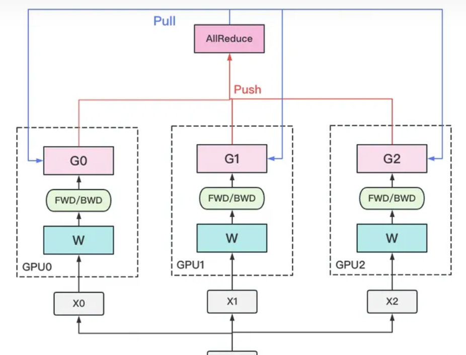

#大模型训练 数据并行、张量模型并行、流水线并行
##数据并行
数据并行的核心思想是：在各个GPU上都拷贝一份完整模型，各自吃一份数据，算一份梯度，最后对梯度进行累加来更新整体模型。理念不复杂，但到了大模型场景，巨大的存储和GPU间的通讯量，就是系统设计要考虑的重点了。在本文中，我们将递进介绍三种主流数据并行的实现方式：

DP（Data Parallelism）：最早的数据并行模式，一般采用参数服务器(Parameters Server)这一编程框架。实际中多用于单机多卡
DDP（Distributed Data Parallelism）：分布式数据并行，采用Ring AllReduce的通讯方式，实际中多用于多机场景
ZeRO：零冗余优化器。由微软推出并应用于其DeepSpeed框架中。严格来讲ZeRO采用数据并行+张量并行的方式，旨在降低存储。

